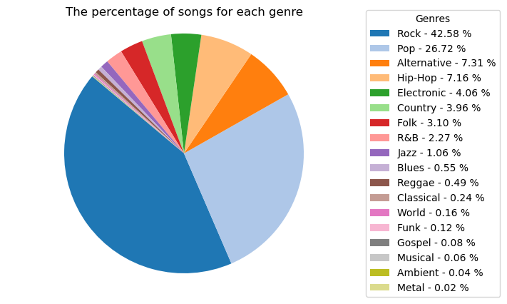
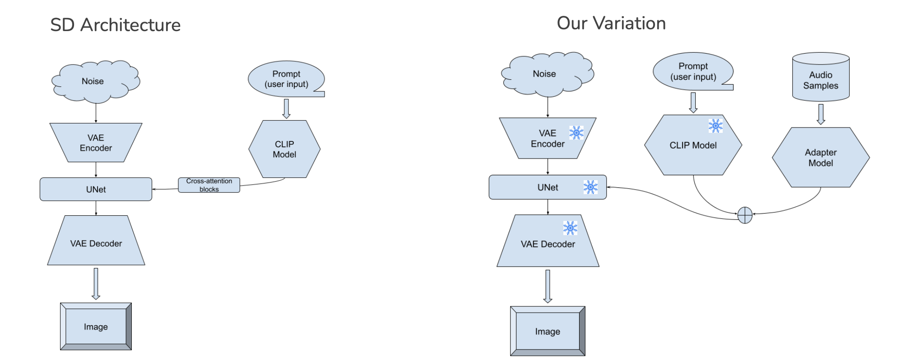
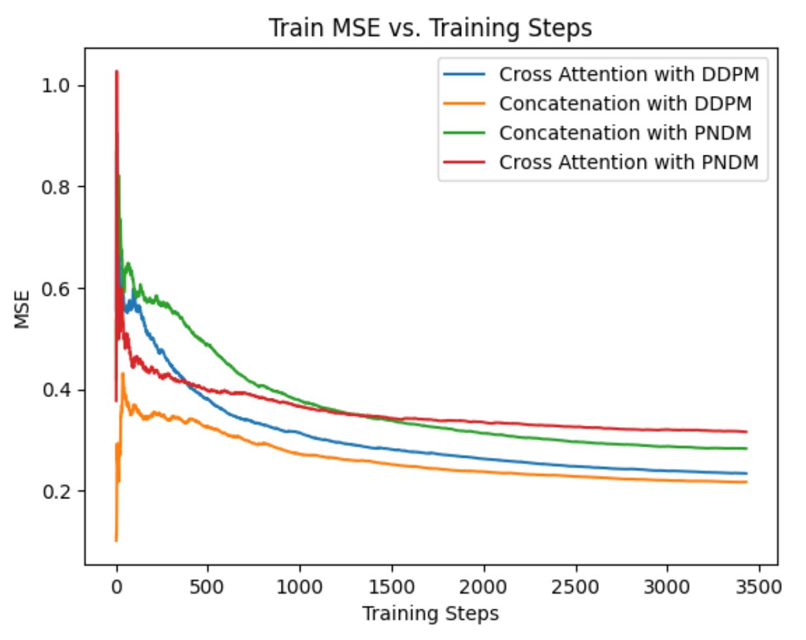
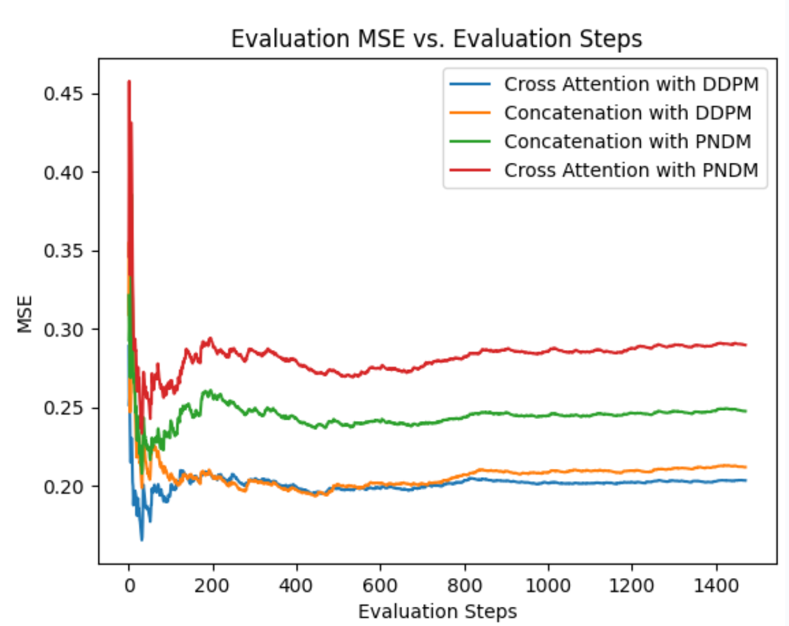

# No-Pain-No-GAN

## Goal of the project

The goal of this project is to utilize generative modeling to automate the creation of album cover art, leveraging the high-dimensional semantic space of audio and metadata (like genre and artist popularity). By incorporating audio cues and album information, the aim is to generate visually appealing and contextually relevant album covers that reflect the essence of the music. This approach is intended to reduce the high costs and labor typically associated with designing album covers, particularly benefiting independent and smaller artists.

## Data Processing
This project involved creating a comprehensive dataset by extracting detailed album information from various sources. The goal was to gather a wide array of data points for each album, ranging from basic metadata to more specific content like song previews and popularity metrics. The data extraction was performed using several web scraping and API tools across multiple platforms, including Wikipedia, Spotify, and YouTube.

### Detailed Steps and Tools Used:

- **Album Information Extraction from Wikipedia (1980-2024):**
  - Utilized different scraping tools due to format variations in older versus newer Wikipedia pages.
  - Tools used: `BeautifulSoup`, `pandas` (`pd.read_html`), `numpy`, `requests`, `urllib`.

- **Data Collection via Spotify Web API:**
  - Extracted `song_id`, `Album_id`, genre (when available), album cover art link, and 30-second song previews (mp3 format).
  - Managed to adhere to the rate limits imposed by the Spotify Web API to ensure efficient data retrieval without interruptions.

- **Popularity Metrics from YouTube:**
  - Initially attempted to use the YouTube API but switched to manual scraping due to severe API limitations on the number of songs processed.
  - Employed Selenium WebDriver for simulating user interactions in a web browser and used multithreading to scrape song popularity metrics across 4 Chrome tabs for a total of 64,000 songs.

- **Data Cleaning and Preparation:**
  - The collected data were exported in both CSV and JSON formats.
  - Conducted extensive data cleaning steps to address missing genres and other data inconsistencies.

- **Generative Model Application:**
  - Utilized the cleaned dataset to train a generative cross-attention-based model for creating album cover art.

### Metadata Analysis
Relevant metadata contained:

- Artist name
- Song name (most popular per album)
- Genres
- Album name
- Top emotions
We used 4899 songs in our project

**Figure 1:Pie Chart of song genres**

## Hume AI
We attempted to use Hume AI API for predicting top-k emotions in audio samples with a goal in mind to extract the emotions and fuse it with embedding space for potentially better, more pertinent art covers. However, due to the nature of Hume AI and it's ability to only process the music exerpts that contain lyrics, we weren't able to extract top-k emotions since most of the extracted .mp3 song previes did not contain the lyrics.

## Variation of Experiments
We proposed the following 4 approaches:
1. Simply prompting SD using lyrics as the prompt
2. Prompting SD using the album name and genre prompt + top K emotions
3. Simply prompting SD using a prompt consisting of the album name and genre
4. Conditioning SD with fused music and text embeddings

The first approach did not work due to the explicit content of the lyrics as well as lyrics copyrights. The second approach failed due to the limitations of Hume AI. This is why we proceeded with the the last two approaches.

## Model Architecture

**Stable Diffusion Architecture (SD)**

- Base Model: Utilizes the miniSD-diffusers, fine-tuned from the Stable Diffusion v1.4 checkpoint. Stable Diffusion is renowned for its efficacy in generating high-quality images.
- Sampling Methodology: Employs DDPM/PNDM samplers to generate images step-by-step from a noise distribution.

**Music Information Retrieval (MIR) Module**
- VQ-VAE: Vector Quantized Variational AutoEncoder that transforms music samples into discrete code sequences. This encoding captures the essential features of the music.
- LLM: A Transformer decoder that uses the discrete codes to generate codified audio, supporting tasks like genre classification, key detection, and emotion recognition.

**Adapter Module**
- Structure: Composed of linear and convolutional layers designed to reshape the music embeddings into a suitable format.
- Integration: Allows the fusion of music features with text embeddings from the CLIP model used in the Stable Diffusion architecture.

**Fusion Module**
- Concatenation and Processing: Combines text and music embeddings and processes them through a linear layer to integrate the different modalities.
- Cross Attention Mechanism: Utilizes a cross attention layer followed by feedforward layers, where the text embeddings serve as queries, and the music embeddings act as keys and values. This setup helps in aligning the musical context with textual cues to generate relevant images.

## Training and Evaluation
- Dataset
  - Train: 3429 samples
  - Evaluation: 1470 samples
  - Prompt: Create an album cover for the album <album name>. The genre is <genre>.
  - Music clip: 25 seconds
  - Image: 256 by 256
- Hyperparameters
  - Samplers: DDPM/PNDM
  - Maximum Timesteps: 150
  - Loss: MSE
  - Batch Size: 1
  - Optimizer: SGD
  - Learning Rate: 1e-4
  - LR Scheduler: Cosine Scheduler with 500 warm up steps
  - Epochs: 1
- Evaluation
  - MSE + FID score for evaluation with ground truth images
  - Qualitative Evaluations

**Figure 2:Model Architecture**

## Ablation Studies

**Figure 3:MSE loss for Training data vs Training steps**

**Figure 4:MSE loss for Evaluation data vs Training steps**

